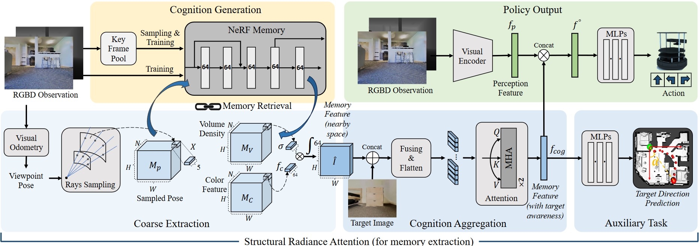
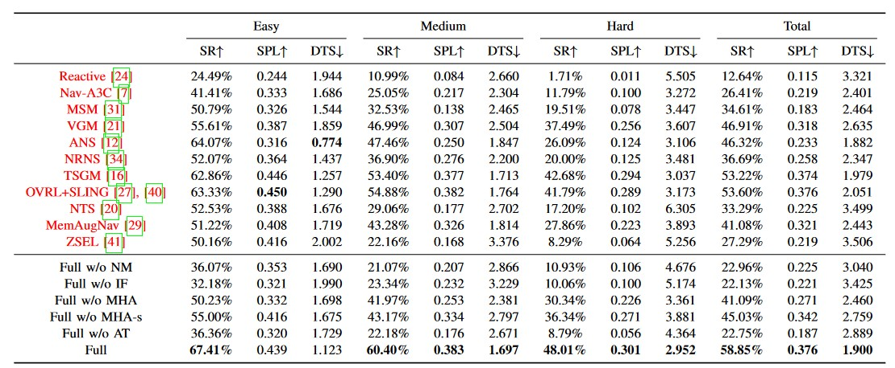

**Integrating Neural Radiance Fields End-to-End for Cognitive Visuomotor Navigation**
==============================================================================================================================
This is the official implementation of TPAMI-2023 paper "**Integrating Neural Radiance Fields End-to-End for Cognitive Visuomotor Navigation**", created by Qiming Liu, Haoran Xin, Zhe Liu and Hesheng Wan. This repository is still being further collated and improved, and the code will be updated recently.

## Abstract

We propose an end-to-end visuomotor navigation framework that leverages Neural Radiance Fields (NeRF) for spatial cognition. To the best of our knowledge, this is the first effort to integrate such implicit spatial representation with embodied policy end-to-end for cognitive decision-making. Consequently, our system does not necessitate modularized designs nor transformations into explicit scene representations for downstream control. The NeRF-based memory is constructed online during navigation, without relying on any environmental priors. To enhance the extraction of decision-critical historical insights from the rigid and implicit structure of NeRF, we introduce a spatial information extraction mechanism named Structural Radiance Attention (SRA). SRA empowers the agent to grasp complex scene structures and task objectives, thus paving the way for the development of intelligent behavioral patterns. Our comprehensive testing in image-goal navigation tasks demonstrates that our approach significantly outperforms existing navigation models. We demonstrate that SRA markedly improves the agent's understanding of both the scene and the task by retrieving historical information stored in NeRF memory. The agent also learns exploratory awareness from our pipeline to better adapt to low signal-to-noise memory signals in unknown scenes. We deploy our navigation system on a mobile robot in real-world scenarios, where it exhibits evident cognitive capabilities while ensuring real-time performance. 

## Prequisites
    python 3.9.8
    CUDA 12.1
    pytorch 2.2.0  
    numpy 1.26.4  
    habitat 3.0

## Usage
### Dataset
The project uses the **Habitat** simulator and **Gibson** environment dataset. The installation of **Habitat** refers to [https://github.com/facebookresearch/habitat-lab](https://github.com/facebookresearch/habitat-lab), and dataset of Gibson environment can be seen at [https://github.com/StanfordVL/GibsonEnv#database](https://github.com/StanfordVL/GibsonEnv#database). 

### Training
Train the network by running 
    
    python main.py --mode 'train'   

Please reminder to specify the `mode`(train), `GPU`,`dataset`(path to dataset),`checkpoint_path`(path to save result) in the scripts.

The training results and saved model parameters will be saved in `checkpoint_path`.

### Testing

Please run 

    python main.py --mode 'test'

Please reminder to specify the `mode`(test), `GPU`,`DATA_PATH`,`SCENES_DIR` and  `model_load` in the scripts.

## Quantitative results:
