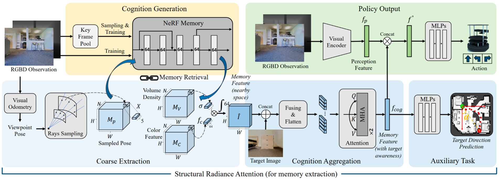

**Integrating Neural Radiance Fields End-to-End for Cognitive Visuomotor Navigation**
==============================================================================================================================
This is the official implementation of TPAMI paper "**Integrating Neural Radiance Fields End-to-End for Cognitive Visuomotor Navigation**" by Qiming Liu, Haoran Xin, Zhe Liu and Hesheng Wang. 

## Abstract

We propose an end-to-end visuomotor navigation framework that leverages Neural Radiance Fields (NeRF) for spatial cognition. To the best of our knowledge, this is the first effort to integrate such implicit spatial representation with embodied policy end-to-end for cognitive decision-making. Consequently, our system does not necessitate modularized designs nor transformations into explicit scene representations for downstream control. The NeRF-based memory is constructed online during navigation, without relying on any environmental priors. To enhance the extraction of decision-critical historical insights from the rigid and implicit structure of NeRF, we introduce a spatial information extraction mechanism named Structural Radiance Attention (SRA). SRA empowers the agent to grasp complex scene structures and task objectives, thus paving the way for the development of intelligent behavioral patterns. Our comprehensive testing in image-goal navigation tasks demonstrates that our approach significantly outperforms existing navigation models. We demonstrate that SRA markedly improves the agent's understanding of both the scene and the task by retrieving historical information stored in NeRF memory. The agent also learns exploratory awareness from our pipeline to better adapt to low signal-to-noise memory signals in unknown scenes. We deploy our navigation system on a mobile robot in real-world scenarios, where it exhibits evident cognitive capabilities while ensuring real-time performance. 

## Overall Pipeline

RGBD observations are stored in the implicit NeRF structure during navigation. We introduce SRA to extract historical memory and promote intelligent behavior patterns. SRA begins by using the current viewpoint as a trigger and coarsely extracts memory cues within the agent's surrounding space. These cues, combined with the target image, are refined through attention operation that focuses the agent on historical data most indicative of the goal's distribution. The memory feature is finally integrated with the instant perceptions to make navigation decisions.

## Prequisites
    python 3.9.8
    CUDA 12.1
    pytorch 2.2.0  
    numpy 1.26.4  
    habitat 3.0

## Usage
### Dataset
The project uses the **Habitat** simulator and photorealistic **Gibson** scene dataset. Please refer to [https://github.com/facebookresearch/habitat-lab](https://github.com/facebookresearch/habitat-lab) for the installation of **Habitat**, and dataset of **Gibson** environment can be downloaded at [https://github.com/StanfordVL/GibsonEnv#database](https://github.com/StanfordVL/GibsonEnv#database). 

### Training
Train the network by running:
    
    python main.py --mode 'train'   

The training results and saved model parameters will be stored in `checkpoint_path`. Please refer to the paper for more detailed training procedures.

Please remember to specify the `mode` (train), `GPU`, `dataset` (path to dataset), and `checkpoint_path` (path to save result) in the scripts.

### Testing

Test the navigation performance of the model by running: 

    python main.py --mode 'test'

Note that NeRF parameters are trained online for scene memory construction, even during model testing.

Please remember to specify the `mode`(test), `GPU`, `DATA_PATH`, `SCENES_DIR` and  `model_load` in the scripts.

### Citation

If you find our work interesting, please cite our paper. (The paper is still under the publication process and will be posted on IEEE Xplore soon. We will update the BibTeX entry later.)

This repository will be further improved. Please raise an issue if you have any questions about the code implementation.
